# Tutorial de instalación
Este tutorial es necesario si se quiere poder jugar al server de Meow. Cubriremos desde parte PREMIUM hasta parte NO-PREMIUM. Si eres premium skippea hasta la sección de *INSTALACIÓN DE MODS*

## Requisitos
### ☕ Java 8
Si no tienes Java 8, descárgalo aquí: https://www.java.com/es/download/ie_manual.jsp
### 📁 Archivos a Instalar
Descargar los ficheros necesarios para la instalación, que deberían estar subidos con este documento, si no adjuntaré el link aquí dentro o por Discord.

## Instalación del launcher NO-PREMIUM

Dentro de la carpeta descargada, encontraremos la carpeta "NO-PREMIUM", dentro de ella habrá un archivo .exe como este

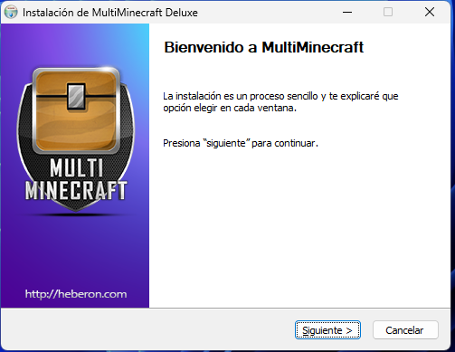

Seguimos los pasos del instalador

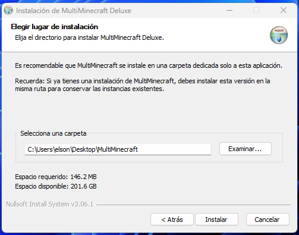

Ponemos la ubicación donde queremos instalar el launcher (dentro de la carpeta se instalará el juego también)

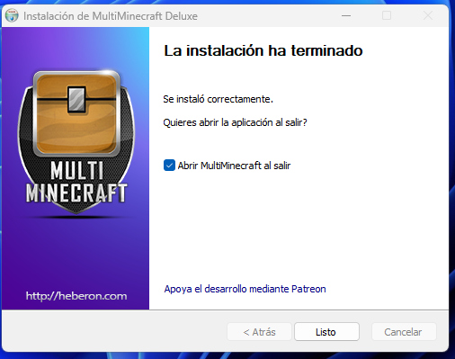

Le damos a listo. En la pantalla de la aplicación, le daremos al engranaje en la parte superior, eso nos lleva a los ajustes.

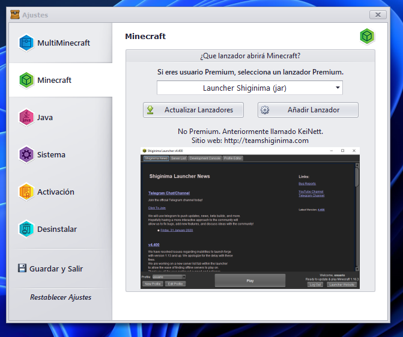

Recomiendo este launcher, es el que mejor me ha ido. Damos en guardar y salir.

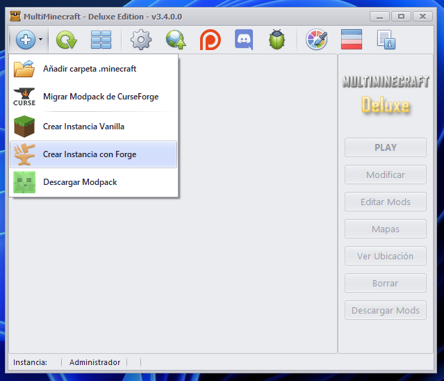

Como vemos en la imagen, pulsamos en el + de arriba a la izquierda y pulsamos en Crear instancia de Forge

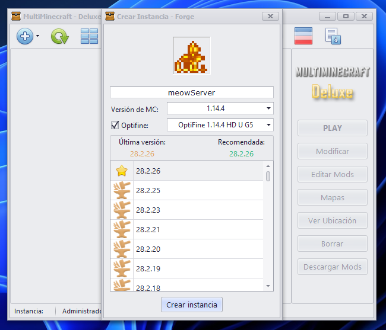

Ponemos las configuraciones como se ve en la imagen, recomiendo poner Optifine, (mejora drásticamente el rendimiento del juego). La versión de Forge importante que también sea la misma de la imagen

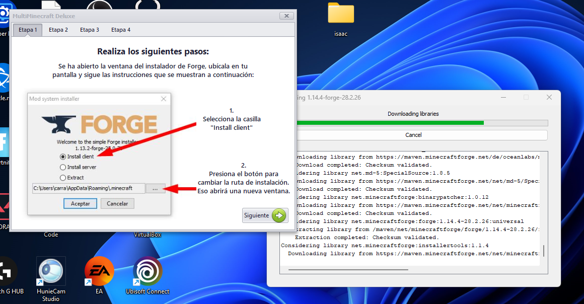

Cuando le demos en crear instancia, nos saldrá la pantalla de arriba, que nos pregunta dónde instalará Forge. Ponemos la ubicación donde hayamos instalado el juego, por ejemplo:
C:/Users/usuario/Desktop/MultiMinecraft/Instancias/1/.minecraft
Tenemos que asegurarnos que sea el .minecraft lo que dejamos ahí. Igualmente, junto a la ventana de Forge se abre una ventana al lado a modo de tutorial por si este paso es complejo.

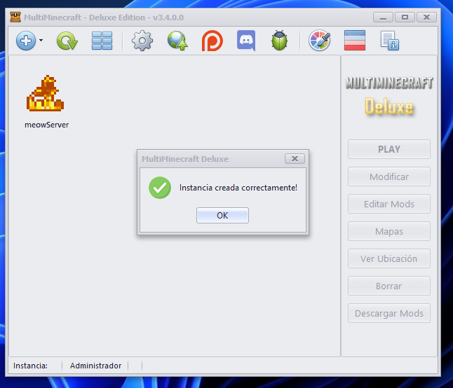

Una vez completado saldrá lo siguiente

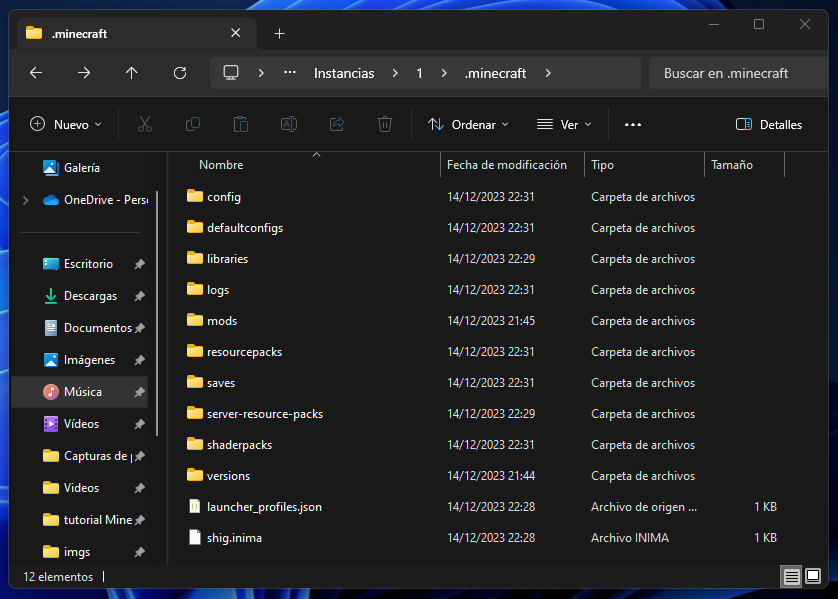

Para evitar errores al arrancar Minecraft, vamos a la carpeta donde tenemos instalado el juego, luego a .minecraft

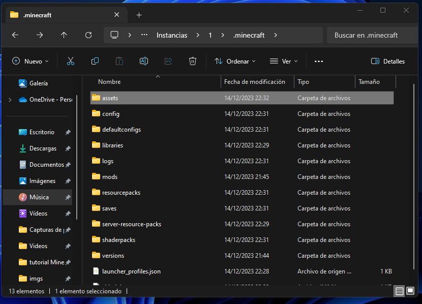

Creamos la carpeta assets como se ve en la imagen de arriba

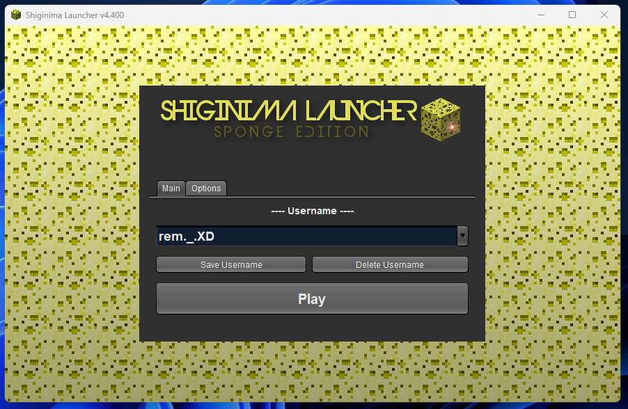

Añadimos el username que vamos a utilizar, le damos en save username, ahora sí nos dejará pulsar en play.

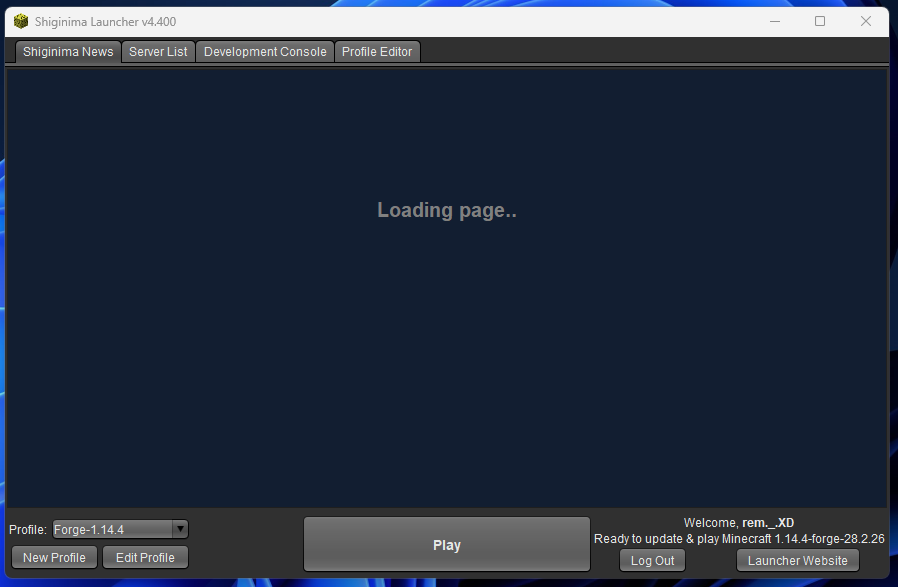

Confirmamos nos aparece el perfil "Forge-1.14.4" a la izquierda. Pulsamos en play

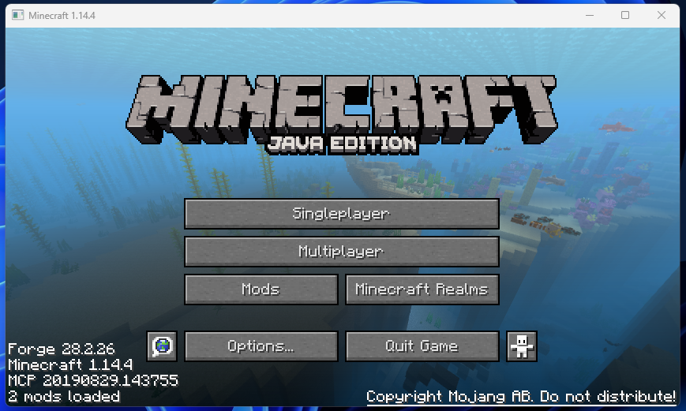

A disfrutar ;)